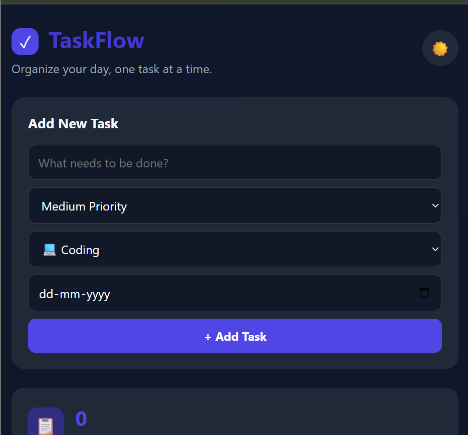
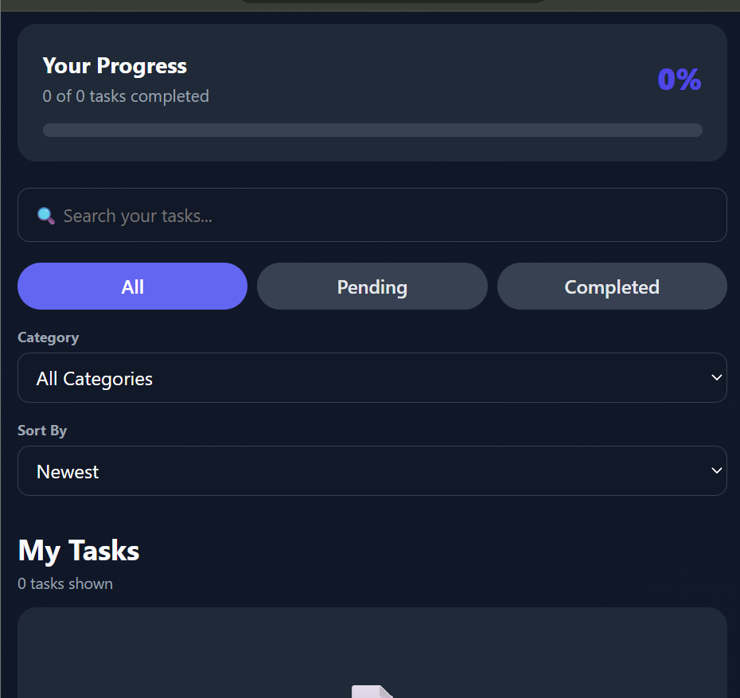
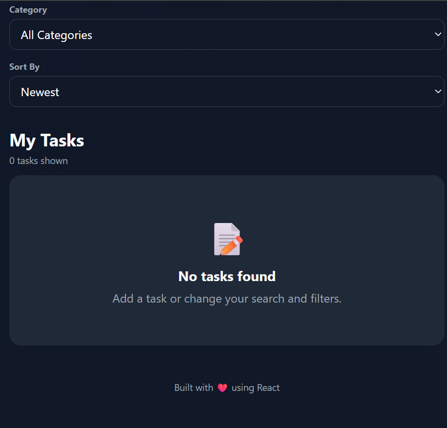

# ✅ TaskFlow

A modern and responsive **Task Management Application** built with **React + Vite**.  
TaskFlow helps users organize daily tasks efficiently with priority levels, categories, due dates, progress tracking, filtering, and searching.

---

## 🚀 Features

- ✨ Add new tasks
- 📝 Edit and delete tasks
- ✅ Mark tasks as completed
- 📊 Real-time progress tracker
- 🔍 Search tasks instantly
- 🏷️ Filter by status
  - All
  - Pending
  - Completed
- 📂 Filter by category
- 📅 Set due dates
- ⚡ Sort tasks
  - Newest
  - Oldest
  - Priority
- 🌙 Beautiful Dark UI
- 📱 Fully Responsive Design

---

# 📸 Screenshots

## Home Page



---

## Progress & Filters



---

## Empty State



---

# 🛠️ Tech Stack

- React
- Vite
- JavaScript (ES6+)
- CSS3
- HTML5

---

# 📁 Project Structure

```text
TaskFlow/
│
├── public/
├── src/
│   ├── assets/
│   ├── components/
│   ├── App.jsx
│   ├── main.jsx
│   └── index.css
│
├── package.json
├── vite.config.js
└── README.md
```


